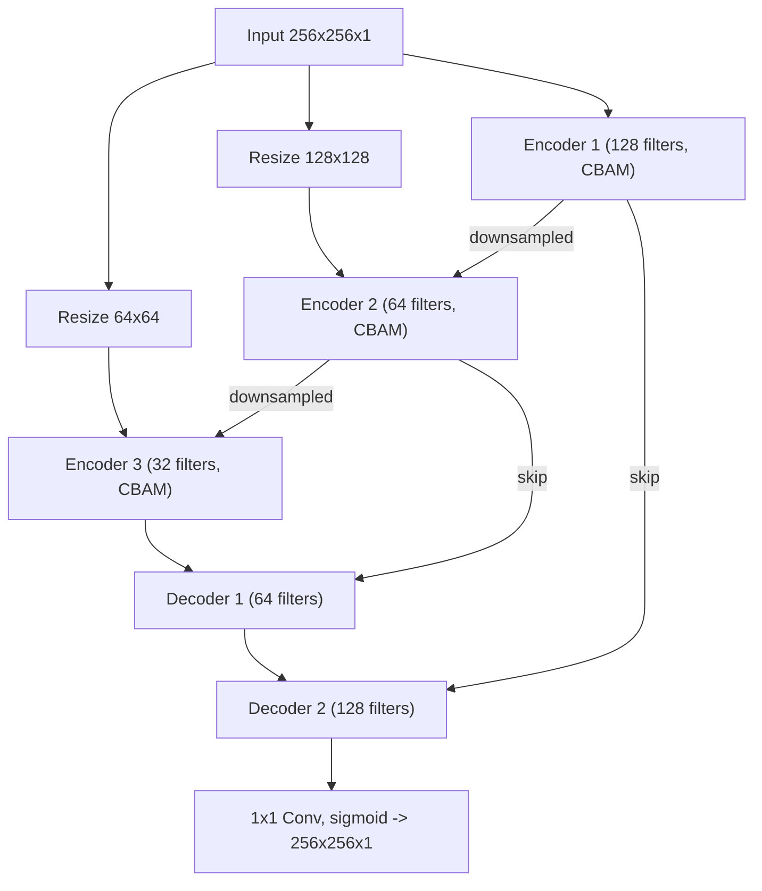

# Architecture — MR²-AttUNet

The model implemented in [`src/cbam_unet/model.py`](../src/cbam_unet/model.py) — branded **MR²-AttUNet** (Motion Removal × Multi-Resolution Attention U-Net) — is a multi-resolution U-Net augmented with a Convolutional Block Attention Module (CBAM) at each encoder stage. A grayscale MRI slice is consumed at three resolutions (full, 1/2, 1/4) and re-injected as additional context into successive encoder stages, while the decoder restores the original resolution via transposed convolutions and skip connections.

## Block diagram

## Components

### Convolutional Block Attention Module (CBAM)

`AttentionBlock` (in `model.py`) implements the standard CBAM formulation:

1. **Channel attention** — global average and max pooling are passed through a shared bottleneck MLP (reduction `ratio=8`); the summed output is sigmoid-activated and broadcast-multiplied back into the feature map.
2. **Spatial attention** — channel-wise mean and max are concatenated and convolved with a 7x7 kernel to produce a spatial gate, which is multiplied into the feature map.

This dual mechanism lets the network *de-weight corrupted features* (channel) and *localise stationary tissue boundaries affected by ghosting* (spatial) — see the paper for the ablation.

### Encoder block

Each `Encoder_Block` performs two `Conv -> BN -> ReLU` stages on the input, applies CBAM to the result, optionally fuses in a downsampled context tensor from the previous encoder, then runs two further `Conv -> BN -> ReLU` stages and a `MaxPool(2,2)`. The pre-pool feature map is returned as a skip connection.

### Decoder block

Each `Decoder_Block` upsamples via `Conv2DTranspose(stride=2)`, concatenates the matching encoder skip, then applies two `Conv -> BN -> ReLU` stages.

### Output block

A 1x1 convolution with sigmoid activation produces a single-channel image in `[0, 1]` ready to be compared against the motion-free target.

## Loss and metrics

Training uses pixel-wise mean squared error (`mse`). Evaluation reports MSE, PSNR (dB) and SSIM, computed per-image and aggregated across the validation pairs and the MR-ART real-motion test set; see [`src/cbam_unet/metrics.py`](../src/cbam_unet/metrics.py).

## Reference

For the motivation and ablations, see the paper *Bridging the Gap: Supervised MRI Motion Artifact Correction via Data Synthesis: A CBAM-U-Net Approach* (Bandara, Herath, Dissanayake, Weerasinghe — Medical Image Analysis, under review).
